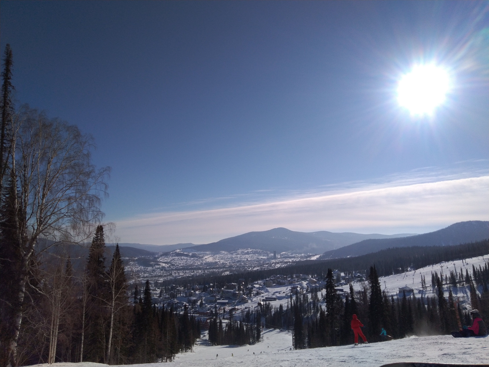

Добавлю тему

## Зима

Добавлю ненумерованные списки

## Зимний пейзаж

* снежные горы
* ледяное озеро
* северное сияние

Добавлю нумерованные списки

## Зимние месяца

1. декабрь
2. январь
3. февраль

Добавлю стихотворение Александра Сергеевича Пушкина

## *Зимнее утро*

Мороз и солнце; день **чудесный!**

Еще ты дремлешь, друг прелестный —

Пора, *красавица*, проснись:

Открой сомкнуты негой взоры

Навстречу северной Авроры,

Звездою севера явись!

~~1~~

Вечор, ты помнишь, вьюга злилась,

На мутном небе мгла носилась;

Луна, как бледное пятно,

Сквозь тучи мрачные желтела,

И **ты** печальная сидела —

А нынче… погляди в окно:

~~2~~

Под *голубыми небесами*

Великолепными коврами,

Блестя на солнце, снег лежит;

Прозрачный лес один чернеет,

И ель сквозь иней зеленеет,

И речка подо льдом блестит.

~~3~~

Вся комната янтарным блеском

Озарена. Веселым треском

Трещит затопленная печь.

Приятно думать у лежанки.

**Но знаешь**: не велеть ли в санки

Кобылку бурую запречь?

~~4~~

Скользя по утреннему снегу,

*Друг милый*, предадимся бегу

Нетерпеливого коня

И навестим поля пустые,

Леса, недавно столь густые,

И берег, милый для **меня**.

~~5~~

**1829 г.**

Добавлю фото зимнего пейзажа

## **Снежные горы**

Добавлю зачеркнутый текст
~~фото от 2019 года~~